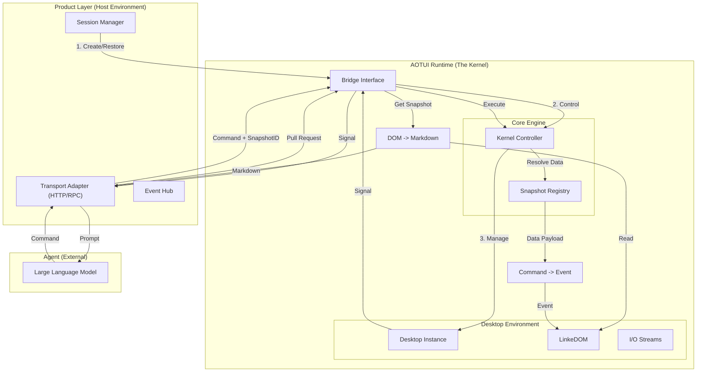
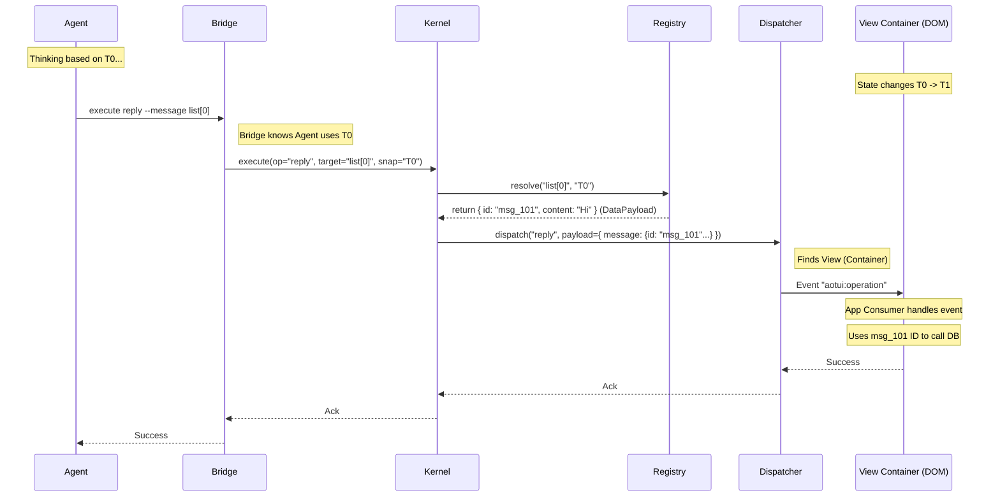
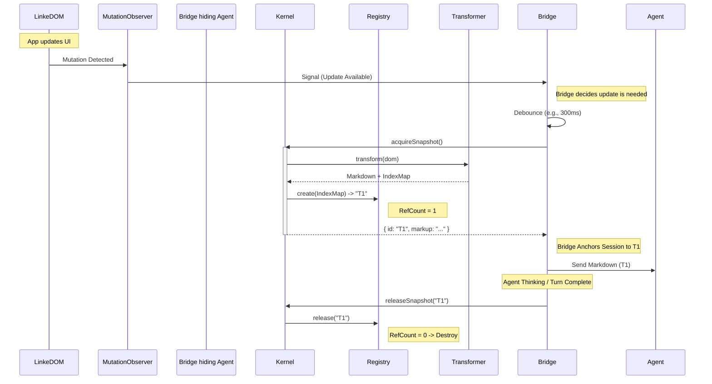
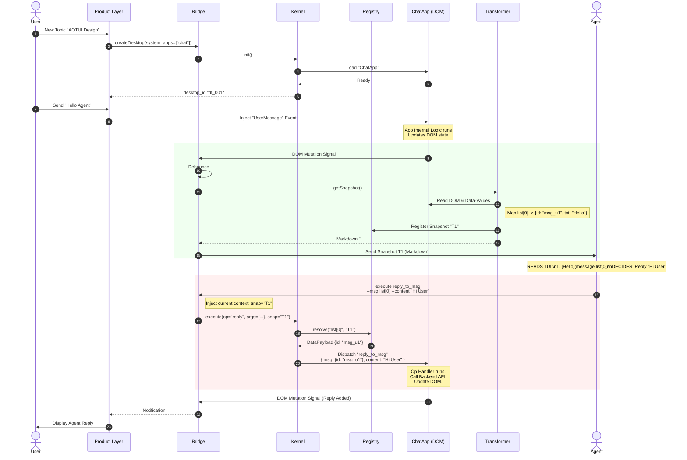
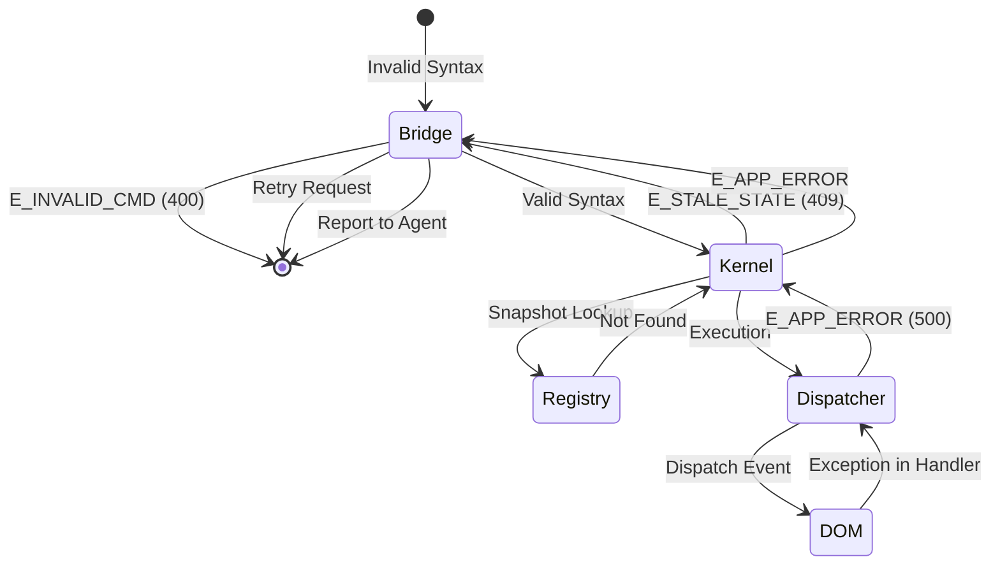

# AOTUI System Design Blueprint

> **Version**: 1.0.0
> **Status**: APPROVED
> **Author**: System Architect (INTJ)

## 1. Architectural Philosophy

The AOTUI (Agent-Oriented Text User Interface) is designed as a **Deterministic State Machine** that bridges the gap between the stateless, text-based nature of LLMs and the stateful, event-driven nature of modern GUIs.

**Core Axioms:**

1. **De-visualized**: The interface is semantic data, not pixels.
2. **Value-Driven**: Operations are function calls on data, not clicks on pixels.
3. **Time-Safe**: State is snapshotted; Actions are executed against specific temporal states but resolved against current data.

---

## 2. High-Level Architecture (System Context)

The system is composed of three distinct layers with strict boundaries: the **Product Layer** (Host), the **AOTUI Runtime** (Kernel), and the **Agent** (User).

---

## 3. Kernel Module Design (Detailed Breakdown)

The Runtime Kernel is organized into strict functional modules.

### 3.1 Interface Layer (`bridge/`)

* **Role**: The "Air Lock" between the Kernel and the Outside World.
* **Responsibilities**:
  * **Protocol Normalization**: Converts external JSON-RPC/API calls into internal Kernel commands.
  * **Implicit ID Management**: Injects the **Active Snapshot ID** (anchored by the Session) into incoming Agent commands.
  * **Lifecycle Management**: Explicitly **Acquires** snapshots when needed and **Releases** them when a turn ends.
  * **Stream Management**: Exposes standard `stdin` (Commands) and `stdout` (Signals).
* **Boundaries**:
  * Input: Raw JSON, Session Context.
  * Output: Standardized `Command` objects, `UpdateSignal`.
  * **Flow Control (Throttling)**: Implements "Leaky Bucket" or "Debounce" strategies for `UpdateSignal` emission (e.g., max 10Hz) to prevent downstream noise. Note: Actual Snapshot generation is **Lazy** (Pull-based), so signals are cheap.

### 3.2 Core Engine Layer (`kernel/`)

* **Role**: The Orchestrator.
* **Responsibilities**:
  * **Lifecycle Management**: Creates/Destroys Desktop instances.
  * **Concurrency Control**: Enforces the **Single-Writer / Multi-Reader** lock model.
  * **Lazy Generation**: Only runs the `Transformer` when `acquireSnapshot()` is called.
  * **Resolution Logic**: Coordinates with the Registry to resolve `Path` -> `DataPayload`.
* **Components**:
  * **Snapshot Registry (`registry/`)**:
    * *Data Structure*: `Map<SnapshotID, CachedSnapshot>`.
    * *Mechanism*: **Reference Counting**.
      * `acquire()`: RefCount = 1.
      * `retain()`: RefCount++.
      * `release()`: RefCount--. If 0, Destroy.
    * *Safety*: **TTL (Time-To-Live)**. Hard expiry (e.g., 10 mins) to prevent leaks if `release()` is missed.

### 3.3 Representation Layer (`transformer/`)

* **Role**: The Renderer (DOM to Text).
* **Responsibilities**:
  * **Traversal**: Efficiently walks the LinkeDOM tree.
  * **Extraction**: Reads semantic attributes (`view`, `list`, `operation`, `data-value`).
  * **Markdown Generation**: Produces the formatted TUI output.
  * **Data Capture**: Extracts `data-value` payloads and builds the `IndexMapping` for the Registry.
* **Input**: LinkeDOM Document.
* **Output**: Markdown String + Index Map.
* **Safety & Limits (Sanitization)**:
  * **Payload Toxicity**: Strict size limit (e.g., 10KB) on `data-value` JSON.
  * **Structure Check**: Shallow parse/copy to prevent Prototype Pollution or Circular References before Registry storage.

### 3.4 Execution Layer (`dispatcher/`)

* **Role**: The Actuator (Text to Event).
* **Responsibilities**:
  * **Targeting**: Locates the `View` or `App` container for the operation.
  * **Event Construction**: Creates `CustomEvent('aotui:operation')`.
  * **Payload Injection**: Merges explicit arguments (from Agent) with resolved data (from Registry).
  * **Dispatch**: Fires the event into the DOM, handling bubbling.
* **Role**: The Actuator (Text to Event).
* **Responsibilities**:
  * **Targeting**: Locates the `View` or `App` container for the operation.
  * **Event Construction**: Creates `CustomEvent('aotui:operation')`.
  * **Payload Injection**: Merges explicit arguments (from Agent) with resolved data (from Registry).
  * **Dispatch**: Fires the event into the DOM, handling bubbling.

### 3.5 Desktop Environment (`desktop/`)

* **Role**: The Sandbox.
* **Responsibilities**:
  * **App Hosting**: Loads App bundles, acts as the "OS".
  * **Resource Management**: Manages the shared LinkeDOM instance.
  * **Isolation**: Ensures Apps cannot crash the Kernel or access unauthorized resources.
  * **Resource Governance (Watchdogs)**:
    * **Heap Limit**: Monitors LinkeDOM memory usage; force-restarts Desktop if limits (e.g., 500MB) are exceeded.
    * **CPU Quota**: Detects run-away loops (e.g., blocking event loop for >1s) and kills the offending App context.

---

## 4. Key Workflows (Sequence Diagrams)

### 4.1 Value-Driven Command Execution (The "Time Travel" Flow)

This diagram illustrates how a command issued against an old snapshot (T0) is successfully executed against the current state (T1) using Data Resolution.

### 4.2 Snapshot Generation Cycle (The "Pull-Lease" Flow)

### 4.3 End-to-End Interaction (The "Hello World" Cycle)

This scenario demonstrates the full lifecycle: New Topic -> User Message -> Agent Reply.

---

## 5. Implementation Specifications

### 5.1 Data Resolution Table

| Input (Agent Command) | Resolution Source | Resolved Output (Event Payload) |
| :--- | :--- | :--- |
| `list[i]` | **Snapshot Registry** | `DataPayload` (JSON Object) |
| `view_id` | **DOM Query** | `HTMLElement` (Container) |
| `--arg "val"` | **Command Parser** | String/Number/Boolean |
| `operation_id` | **Command Parser** | Event Name (`aotui:operation`) |

### 5.2 Error Propagation

## 6. Review Checklist (Definition of Done)

* [ ] **Modularity**: Are `kernel` (logic) and `desktop` (environment) decoupled?
* [ ] **Isolation**: Is the user's implicit session state managed strictly in the `Bridge`?
* [ ] **Determinism**: Does the Registry guarantee consistent data resolution regardless of UI shifts?
* [ ] **Constraint**: Is the `Input Stream` strictly Single-Writer enforced?

---
*End of Design Document*
