# AOTUI User Journey

> **Version**: 1.0.0  
> **Purpose**: Document the end-to-end user journey from both Human User and LLM Agent perspectives  
> **Aligns With**: SYSTEM_DESIGN.md v1.0.0

---

## Overview

This document illustrates the complete interaction flow when a user creates a new topic and sends a message to the LLM Agent. We examine this journey from two perspectives:

1. **Human User Perspective**: What the user sees and does
2. **LLM Agent Perspective**: What the Agent sees in the TUI

---

## Architecture Components Reference

> This journey involves the following layers from `SYSTEM_DESIGN.md`:

| Layer | Component | Role |
|-------|-----------|------|
| **Product Layer** | Session Manager, Transport, Event Hub | Host Environment |
| **AOTUI Runtime** | Bridge | "Air Lock" between Product and Kernel |
| **AOTUI Runtime** | Kernel | Orchestrator, manages lifecycle and concurrency |
| **AOTUI Runtime** | Registry | Snapshot storage with reference counting |
| **AOTUI Runtime** | Desktop | Sandbox for Apps, HappyDOM host |
| **AOTUI Runtime** | Transformer | DOM → Markdown renderer |
| **AOTUI Runtime** | Dispatcher | Command → Event actuator |
| **External** | Agent (LLM) | Consumer of TUI |

---

## Journey Map: New Topic & First Message

### Full System Interaction

```mermaid
sequenceDiagram
    participant User as 👤 Human User
    participant Product as 🎨 Product Layer
    participant Bridge as 🚪 Bridge Interface
    participant Kernel as ⚙️ Kernel
    participant Registry as 📦 Snapshot Registry
    participant Desktop as 🖥️ Desktop Instance
    participant ChatApp as 💬 ChatWithUser App
    participant ThinkApp as 🧠 ThoughtRecorder App
    participant Transformer as 📝 Transformer
    participant Dispatcher as 🎯 Dispatcher
    participant Agent as 🤖 LLM Agent

    %% Phase 1: Create New Topic
    User->>Product: Click "New Topic"
    Product->>Bridge: createSession(config)
    Bridge->>Kernel: init(systemApps)
    Kernel->>Desktop: Initialize empty Desktop
    Kernel->>ChatApp: Auto-install System App
    Kernel->>ThinkApp: Auto-install System App
    Kernel-->>Bridge: Desktop Ready
    Bridge-->>Product: Return Session Handle
    
    %% Phase 2: User Sends Message
    User->>Product: Type & Send: "帮我写一份报告"
    Product->>Bridge: injectUserEvent(message)
    Bridge->>Kernel: forward to Desktop
    Kernel->>ChatApp: userMessage Event
    ChatApp->>ChatApp: Update DOM (add user message)
    
    %% Phase 3: Signal & Pull Pattern (with Snapshot ID)
    ChatApp->>Desktop: DOM Mutation
    Desktop->>Bridge: emit UpdateSignal
    Bridge->>Bridge: Debounce (e.g., 300ms)
    
    Bridge->>Kernel: acquireSnapshot()
    Kernel->>Transformer: transform(dom)
    Transformer->>Desktop: Read DOM & Data-Values
    Transformer-->>Kernel: Markdown + IndexMap
    Kernel->>Registry: create(IndexMap) → "snap_T1"
    Note right of Registry: RefCount = 1, TTL = 10min
    Registry-->>Kernel: SnapshotID "snap_T1"
    Kernel-->>Bridge: { id: "snap_T1", markup: "..." }
    
    Bridge->>Bridge: Anchor Session to snap_T1
    Bridge->>Product: Snapshot Ready
    Product->>Agent: Send Markdown (via Transport)
    
    Note over Agent: 🔍 Agent sees TUI Snapshot<br/>(ChatWithUser + ThoughtRecorder)<br/>Agent enters serial processing

    %% Phase 4: Agent Thinks (with Implicit Snapshot ID)
    Agent->>Product: Command: log_thought --content "分析用户需求..."
    Product->>Bridge: execute(cmd)
    Note right of Bridge: Inject snap="snap_T1"
    Bridge->>Kernel: execute(op, args, snap="snap_T1")
    
    Kernel->>Registry: resolve("thought_list", "snap_T1")
    Registry-->>Kernel: {} (empty, first thought)
    
    Kernel->>Dispatcher: dispatch("log_thought", payload)
    Dispatcher->>Dispatcher: Construct CustomEvent('aotui:operation')
    Dispatcher->>ThinkApp: Fire Event (bubbling)
    ThinkApp->>ThinkApp: Record thought in DOM
    ThinkApp-->>Dispatcher: Event Handled
    Dispatcher-->>Kernel: Ack
    Kernel-->>Bridge: Ack
    Bridge-->>Product: CommandAck (success)
    Product-->>Agent: ACK received
    
    %% Phase 4.5: New Snapshot after Thought
    Desktop->>Bridge: emit UpdateSignal
    Bridge->>Kernel: acquireSnapshot()
    Kernel->>Registry: create(...) → "snap_T2"
    Note right of Registry: snap_T1 still held
    Kernel-->>Bridge: { id: "snap_T2", markup: "..." }
    Bridge->>Kernel: releaseSnapshot("snap_T1")
    Kernel->>Registry: release("snap_T1")
    Note right of Registry: RefCount = 0 → Destroy
    Bridge->>Bridge: Anchor Session to snap_T2
    Bridge->>Product: Updated Snapshot
    Product->>Agent: Send Markdown (snap_T2)

    %% Phase 5: Agent Responds
    Agent->>Product: Command: send_message --content "好的，请问报告主题？"
    Product->>Bridge: execute(cmd)
    Note right of Bridge: Inject snap="snap_T2"
    Bridge->>Kernel: execute(op, args, snap="snap_T2")
    
    Kernel->>Registry: resolve("message_list", "snap_T2")
    Registry-->>Kernel: DataPayload {messages: [...]}
    
    Kernel->>Dispatcher: dispatch("send_message", payload)
    Dispatcher->>ChatApp: Fire Event
    ChatApp->>ChatApp: Add agent message to DOM
    ChatApp-->>Dispatcher: Event Handled
    Dispatcher-->>Kernel: Ack
    Kernel-->>Bridge: Ack
    Bridge->>Kernel: releaseSnapshot("snap_T2")
    Bridge-->>Product: CommandAck (success)
    ChatApp->>Product: Emit display event
    Product->>User: Display LLM response
    
    User->>User: 👀 Read response
```



---

## Phase-by-Phase Breakdown

### Phase 1: Topic Creation (Desktop Initialization)

#### Human User View

```
┌─────────────────────────────────────────┐
│  Gemini Chat                     [+]    │
├─────────────────────────────────────────┤
│  📝 Topics                              │
│  ├─ Work Projects                       │
│  ├─ Personal Notes                      │
│  └─ [+ New Topic] ← USER CLICKS         │
└─────────────────────────────────────────┘
```

#### LLM Agent View (Initial TUI Snapshot)

```markdown
<desktop id="desktop_001">

<app id="system.chat" name="ChatWithUser" system="true">
<view id="view_001" name="Conversation">

# Conversation
- Status: Empty conversation
- Participants: User, Agent

## Operations
- [SendMessage](operation:send_message)
    - Arguments:
        - content: string

</view>
</app>

<app id="system.thought" name="ThoughtRecorder" system="true">
<view id="view_002" name="ThoughtLog">

# Thought Log
(Empty - no thoughts yet)

## Operations
- [LogThought](operation:log_thought)
    - Arguments:
        - content: string

</view>
</app>

</desktop>
```

#### Product Layer Code Example

```typescript
// User clicks "New Topic"
async function handleNewTopic() {
  // 1. Create new Session via Bridge
  const session = await bridge.createSession({
    systemApps: ['system.chat', 'system.thought']
  });
  
  // 2. Store mapping: Topic → Session
  topicStore.set(currentTopicId, session.id);
  
  // 3. Subscribe to signals from Bridge
  session.onSignal((signal: UpdateSignal) => {
    // Bridge handles debouncing internally
    handleDesktopUpdate(signal);
  });
}
```

---

### Phase 2: User Sends First Message

#### Human User View

```
┌─────────────────────────────────────────┐
│  New Topic                              │
├─────────────────────────────────────────┤
│                                         │
│  User: 帮我写一份报告 ⏎                  │
│  ┌─────────────────────────────────┐   │
│  │ Type your message...            │   │
│  └─────────────────────────────────┘   │
└─────────────────────────────────────────┘
```

#### LLM Agent View (Updated TUI Snapshot with Snapshot ID)

```markdown
<!-- Snapshot ID: snap_T1 -->
<desktop id="desktop_001">

<app id="system.chat" name="ChatWithUser" system="true">
<view id="view_001" name="Conversation">

# Conversation

## [Message List](message[]:message_list)
1. [2025-12-07 18:57:23 - User: 帮我写一份报告](message:message_list[0])

## Operations
- [SendMessage](operation:send_message)
    - Arguments:
        - content: string
    - Description: Send a reply to the user

</view>
</app>

<app id="system.thought" name="ThoughtRecorder" system="true">
<view id="view_002" name="ThoughtLog">

# Thought Log
(Empty - ready to log)

## Operations
- [LogThought](operation:log_thought)

</view>
</app>

</desktop>
```

#### Product Layer Code Example

```typescript
// User sends message
async function handleUserMessage(content: string) {
  const session = getSessionForCurrentTopic();
  
  // Inject user event via Bridge (not directly to Desktop)
  await bridge.injectUserEvent(session.id, {
    type: 'user_message',
    payload: { content, timestamp: Date.now() }
  });
  
  // Bridge will:
  // 1. Forward to Kernel → Desktop → ChatApp
  // 2. Receive DOM mutation signal
  // 3. Debounce updates
  // 4. Call acquireSnapshot() lazily
  // 5. Emit UpdateSignal to our handler
}

// Handler receives snapshot with ID
function handleDesktopUpdate(signal: UpdateSignal) {
  // signal.snapshotId = "snap_T1"
  // signal.markdown = "..."
  sendToAgent(signal.snapshotId, signal.markdown);
}
```

---

### Phase 3: Agent Thinks & Records Thought

#### Bridge: Implicit Snapshot ID Injection

When the Agent sends a command, the **Bridge** automatically injects the **Active Snapshot ID** that the Agent is currently working with:

```typescript
// Agent sends (Snapshot ID is implicit, managed by Bridge)
execute log_thought --content "用户需要写报告，我需要先了解报告类型、目标受众、主题等信息"

// Bridge transforms to (internal representation)
{
  operation: "log_thought",
  args: { content: "用户需要写报告..." },
  snapshotId: "snap_T1"  // ← Injected by Bridge
}
```

#### Registry: Data Resolution Flow

```mermaid
sequenceDiagram
    participant Kernel
    participant Registry
    participant Dispatcher
    participant App as ThoughtRecorder

    Kernel->>Registry: resolve("thought_list", "snap_T1")
    Note right of Registry: Lookup IndexMap for snap_T1<br/>Find path "thought_list" → DataPayload
    Registry-->>Kernel: { thoughts: [] } (empty array)
    
    Kernel->>Dispatcher: dispatch("log_thought", {<br/>  content: "...",<br/>  resolved: { thoughts: [] }<br/>})
    
    Dispatcher->>Dispatcher: Construct Event
    Note right of Dispatcher: new CustomEvent('aotui:operation', {<br/>  detail: { op: 'log_thought', ... }<br/>})
    
    Dispatcher->>App: dispatchEvent (bubbles up)
    App->>App: Handle event, update DOM
```



#### Updated TUI Snapshot (After Thought Logged)

```markdown
<!-- Snapshot ID: snap_T2 -->
<app id="system.thought" name="ThoughtRecorder">
<view id="view_002">

# Thought Log

## [Thoughts](thought[]:thought_list)
1. [18:57:24 - 用户需要写报告，我需要先了解报告类型、目标受众、主题等信息](thought:thought_list[0])

</view>
</app>
```

---

### Phase 4: Agent Responds to User

#### Dispatcher: Event Construction Flow


#### Human User View (After Response)

```
┌─────────────────────────────────────────┐
│  New Topic - Report Writing            │
├─────────────────────────────────────────┤
│  User: 帮我写一份报告                    │
│                                         │
│  🤖 Agent: 好的，我来帮你写报告。        │
│  请问：                                  │
│  1. 报告的主题是什么？                   │
│  2. 目标受众是谁？                       │
│  3. 需要包含哪些核心内容？               │
│                                         │
│  ┌─────────────────────────────────┐   │
│  └─────────────────────────────────┘   │
└─────────────────────────────────────────┘
```

---

## Component Deep Dive

### Bridge Interface: The "Air Lock"


**Responsibilities:**

| Function | Description |
|----------|-------------|
| **Protocol Normalization** | Converts external JSON-RPC/API calls into internal Kernel commands |
| **Implicit ID Management** | Injects Active Snapshot ID into Agent commands |
| **Lifecycle Management** | Calls `acquireSnapshot()` / `releaseSnapshot()` |
| **Stream Management** | Exposes `stdin` (Commands) and `stdout` (Signals) |
| **Throttling** | Debounce/Leaky Bucket for UpdateSignal (max 10Hz) |

---

### Snapshot Registry: Reference Counting

```mermaid
stateDiagram-v2
    [*] --> Created: create(IndexMap)
    Created --> Active: RefCount = 1
    Active --> Active: retain() → RefCount++
    Active --> Released: release() → RefCount--
    Released --> Active: RefCount > 0
    Released --> Destroyed: RefCount = 0
    Active --> Destroyed: TTL Expired (10min)
    Destroyed --> [*]
```



**Data Structure:**

```typescript
interface SnapshotRegistry {
  snapshots: Map<SnapshotID, CachedSnapshot>;
  
  create(indexMap: IndexMap): SnapshotID;  // RefCount = 1
  acquire(id: SnapshotID): void;           // RefCount++
  release(id: SnapshotID): void;           // RefCount--, destroy if 0
  resolve(path: string, id: SnapshotID): DataPayload;
}

interface CachedSnapshot {
  id: SnapshotID;
  indexMap: Map<string, DataPayload>;  // "list[0]" → { id: "msg_101", ... }
  refCount: number;
  createdAt: number;
  ttl: number;  // Hard expiry: 10 minutes
}
```

---

### Dispatcher: Event Actuator


**Event Payload Structure:**

```typescript
interface AOTUIOperationEvent extends CustomEvent {
  type: 'aotui:operation';
  detail: {
    operation: string;           // "send_message"
    args: Record<string, any>;   // { content: "..." }
    payload: DataPayload;        // Resolved data from Registry
    snapshotId: SnapshotID;      // For debugging/logging
  };
}
```

---

## Data Flow Diagram

```mermaid
graph TB
    subgraph "Human World"
        User[👤 User]
        UI[🎨 Product UI]
    end
    
    subgraph "Bridge Layer"
        Bridge[🚪 Bridge Interface]
    end
    
    subgraph "AOTUI Runtime"
        Kernel[⚙️ Kernel]
        Registry[📦 Registry]
        Desktop[🖥️ Desktop Instance]
        ChatApp[💬 ChatWithUser]
        ThinkApp[🧠 ThoughtRecorder]
        Transformer[📝 DOM→MD Transformer]
        Dispatcher[🎯 Dispatcher]
    end
    
    subgraph "Agent World"
        Agent[🤖 LLM Agent]
    end
    
    User -->|1. New Topic| UI
    UI -->|2. createSession| Bridge
    Bridge -->|3. init| Kernel
    Kernel -->|4. Auto-install| ChatApp
    Kernel -->|4. Auto-install| ThinkApp
    
    User -->|5. Send Message| UI
    UI -->|6. injectUserEvent| Bridge
    Bridge -->|7. forward| Kernel
    Kernel -->|8. event| ChatApp
    ChatApp -->|9. DOM Mutation| Desktop
    Desktop -->|10. Signal| Bridge
    Bridge -->|11. acquireSnapshot| Kernel
    Kernel -->|12. transform| Transformer
    Transformer -->|13. IndexMap| Registry
    Registry -->|14. SnapshotID| Bridge
    Bridge -->|15. Markdown + ID| Agent
    
    Agent -->|16. Command| Bridge
    Bridge -->|17. Inject SnapshotID| Kernel
    Kernel -->|18. resolve| Registry
    Registry -->|19. DataPayload| Kernel
    Kernel -->|20. dispatch| Dispatcher
    Dispatcher -->|21. Event| ChatApp
    ChatApp -->|22. Display Event| UI
    UI -->|23. Show| User
    
    style Bridge fill:#fff9c4
    style Registry fill:#e1f5fe
    style Dispatcher fill:#f3e5f5
```



---

## State Transitions

### Desktop Lifecycle


### Snapshot Lifecycle


### Message Flow States


---

## Key Insights

### For Human Users

- 🚀 **Fast**: Topic creation is instant (no waiting for Desktop setup)
- 🎯 **Focused**: Each topic is isolated, no cross-contamination
- 🔄 **Resumable**: Can return to old topics with full context restored

### For LLM Agents

- 🧹 **Clean State**: Each Desktop starts fresh
- 👁️ **Full Visibility**: Can see conversation + thoughts in one snapshot
- 🎛️ **Control**: Can manage multiple apps (not just chat)
- 📝 **Private Space**: ThoughtRecorder is internal, user never sees it
- 🔗 **Implicit Context**: Snapshot ID is managed by Bridge, no manual tracking

### For Developers (Product Layer)

- 🔌 **Decoupled**: Bridge abstracts all Kernel internals
- 💾 **Storage Freedom**: Choose your own persistence strategy
- 🎨 **UI Freedom**: Desktop state is separate from your UI framework
- 🔒 **Isolation Guaranteed**: Bridge enforces Desktop boundaries
- ⏱️ **Time-Safe**: Registry ensures data consistency across snapshots

---

## Extended Scenario: Agent Opens Another App

Imagine the Agent decides it needs to search files to write the report:

```xml
<context desktop="desktop_001">
    open --app com.example.filemanager
</context>
```

**Bridge Processing:**

```typescript
// Bridge receives command
bridge.execute({
  operation: "open",
  args: { app: "com.example.filemanager" },
  snapshotId: "snap_T2"  // Implicit injection
});

// Kernel validates app exists, loads into Desktop
// New snapshot generated after app opens
```

**Updated TUI Snapshot:**

```markdown
<!-- Snapshot ID: snap_T3 -->
<desktop id="desktop_001">

<app id="system.chat">...</app>
<app id="system.thought">...</app>

<app id="com.example.filemanager" name="File Manager">
<view id="view_003" name="Home">

# Files
- [Documents](folder:docs)
- [Downloads](folder:downloads)

## Operations
- [Search](operation:search_files)
- [Open](operation:open_file)

</view>
</app>

</desktop>
```

**Human User Never Sees This** — The File Manager is part of the Agent's workspace, not exposed to the Product UI (unless the Product Layer chooses to visualize it).

---

## Summary

This journey demonstrates:

1. **Desktop Isolation**: Each topic = independent Desktop instance
2. **Bridge as Air Lock**: All communication goes through Bridge
3. **Snapshot Registry**: Reference-counted, TTL-protected data store
4. **Dispatcher Pipeline**: Structured event construction and dispatch
5. **Implicit ID Management**: Agent doesn't track Snapshot IDs manually
6. **Bidirectional Flow**: User → Product → Bridge → Kernel → Desktop → Transformer → Agent → Bridge → Dispatcher → App → User
7. **State Management**: Runtime handles serialization, Product handles storage
8. **Separation of Concerns**: UI (Product), Protocol (Bridge), Logic (Kernel), Intelligence (Agent)

---
*End of User Journey Document*
